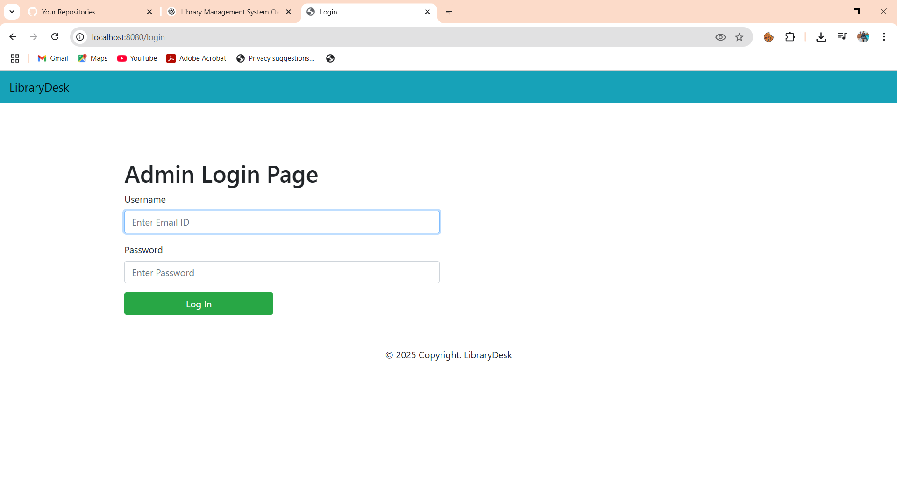
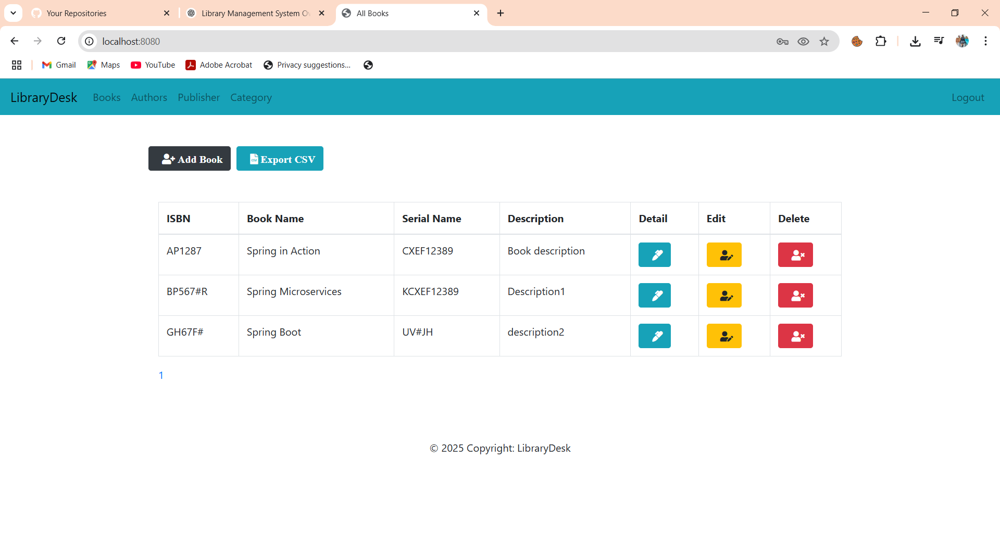
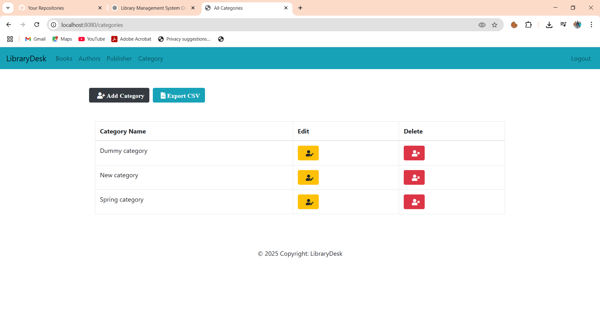
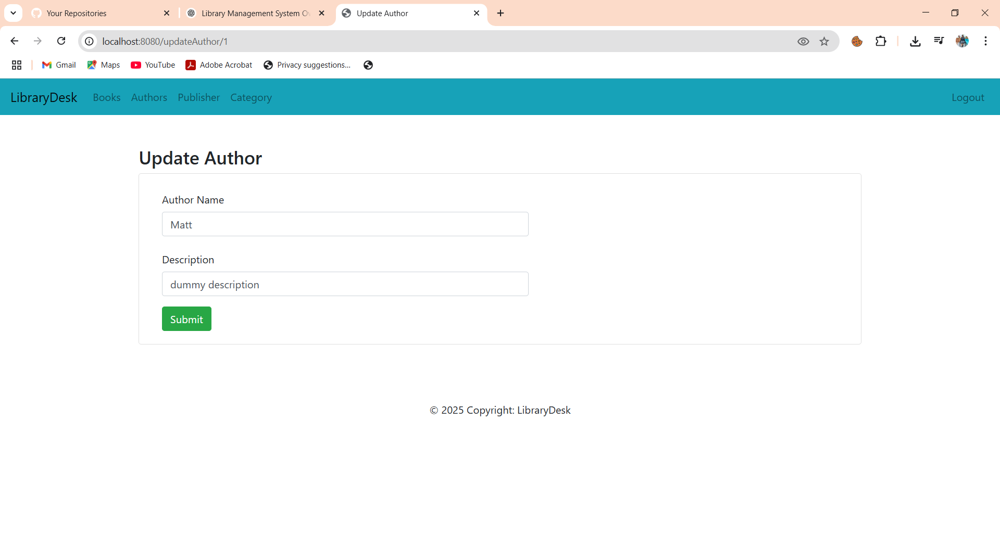

# LibraryDesk - Library Management System

LibraryDesk is a **Library Management System** built using **Spring Boot, Java, Thymeleaf, and H2**. It provides an **Admin Login** to manage books, authors, categories, and publishers efficiently.

## Features 🚀

✅ **Admin Login & Dashboard** 🔑  
✅ **Manage Books (Add, View, Update, Delete)** 📖  
✅ **Manage Authors** 🖊️  
✅ **Manage Categories** 📂  
✅ **Manage Publishers** 🏢  
✅ **Search Books by Title, Author, Genre** 🔍  
✅ **Data Persistence with MySQL** 🗄️  
✅ **Spring Boot + Thymeleaf UI** 🎨  

---

## 🛠️ Tech Stack

- **Backend:** Java, Spring Boot, Spring Data JPA, JDBC, H2
- **Frontend:** Thymeleaf, HTML, CSS, JavaScript
- **Security:** Spring Security (Admin Login)
- **Database:** H2 
- **IDE:** VS Code

---

## 📊 Database Schema

| Table Name       | Columns |
|-----------------|---------------------------|
| `authors`       | `author_id`, `name`       |
| `books`         | `book_id`, `title`, `genre`, `rating`, `available`, `author_id`, `category_id`, `publisher_id` |
| `categories`    | `category_id`, `name`     |
| `publishers`    | `publisher_id`, `name`    |

---

## 📸 Screenshots

### 1. Login Page


### 2. Home Page


### 3. Add Category 


### 4. Update Author


---

## 🏗️ Installation Steps

1️⃣ **Clone the repository:**
```sh
https://github.com/Anugupta5102/LibraryDesk.git
```

2️⃣ **Navigate to the project directory:**
```sh
cd LibraryDesk
```

3️⃣ **Configure MySQL Database** (Update `application.properties` file):
```properties
spring.datasource.url=jdbc:mysql://localhost:3306/library_db
spring.datasource.username=root
spring.datasource.password=your_password
spring.jpa.hibernate.ddl-auto=update
```

4️⃣ **Run the application:**
```sh
mvn spring-boot:run
```

5️⃣ **Access the application:**  
📌 Open: `http://localhost:8080/`

---

## 🔗 API Endpoints (Admin Features)

| Endpoint          | Method | Description             |
|------------------|--------|-------------------------|
| `/books`         | GET    | View all books          |
| `/book/{id}`     | GET    | View a book by ID       |
| `/add-book`      | POST   | Add a new book          |
| `/update-book/{id}` | PUT | Update book details     |
| `/remove-book/{id}` | DELETE | Delete a book      |
| `/authors`       | GET    | View all authors        |
| `/add-author`    | POST   | Add a new author        |
| `/categories`    | GET    | View all categories     |
| `/add-category`  | POST   | Add a new category      |
| `/publishers`    | GET    | View all publishers     |
| `/add-publisher` | POST   | Add a new publisher     |

---

## 📜 License

This project is licensed under the **MIT License**.

---

## 🤝 Contributing

1. Fork the repo.
2. Create a new branch (`git checkout -b feature-branch`).
3. Commit your changes (`git commit -m 'Add new feature'`).
4. Push to the branch (`git push origin feature-branch`).
5. Open a Pull Request.

---

### 📬 Need help?

If you have any questions, feel free to open an issue or reach out! 😊
